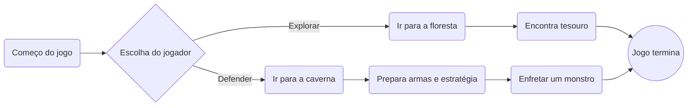
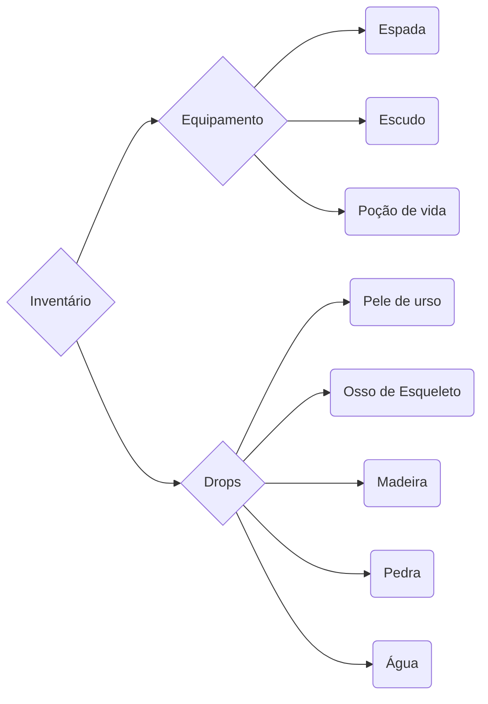

# Jogo

## Descrição
Um jogo top.

#### Requisitos:
- Mínimo de 2 jogadores.
- Plataformas disponíveis: Windows, Android, PlayStation, XBox, Nintendo Switch
- Controlos:
    > `'WASD'` - movement.
    > `'SPACE'` - jump (Click again for double jump).
    > `'Left-click'`(mouse) - Shoot.

#### Icon:
> 

#### Download link:
> [Windows](https://google.com)
> [MacOS](https://gethelp.com/find-treatment-now/#/)

### Gameplay

### Notas Finais
Não é dinheiro
##### Como ganhar o jogo:
1. Escolher a opção correta.
2. Vencer o jogo.
3. Big Ws in the chat! GG WP EZ

##### Inventário
